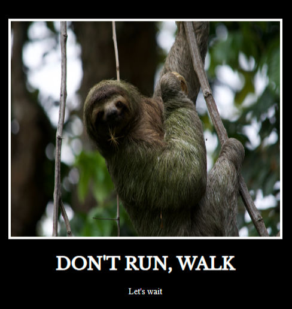

# Motivational Poster

## Frontend Challenge

## Description

This was a coding challenge presented by [Dr. Angela Yu](https://www.udemy.com/user/4b4368a3-b5c8-4529-aa65-2056ec31f37e/) within her [Udemy Course](https://www.udemy.com/course/the-complete-web-development-bootcamp/).

## Challenge Instructions

TODO: Create a motivational post website.
Style it how ever you like.
Look at the goal image for inspiration.
But it must have the following features:

1. The main h1 text should be using the Regular Libre Baskerville Font from Google Fonts:
   https://fonts.google.com/specimen/Libre+Baskerville
2. The text should be white and background black.
3. Add your own image into the images folder inside assets. It should have a 5px white border.
4. The text should be center aligned.
5. Create a div to contain the h1, p and img elements. Adjust the margins so that the image and text are centered on the page.
   Hint: You horizontally center a div by giving it a width of 50% and a margin-left of 25%.
   Hint: Set the image to have a width of 100% so it fills the div.
6. Read about the text-transform property on MDN docs to make the h1 uppercase with CSS.
   https://developer.mozilla.org/en-US/docs/Web/CSS/text-transform

## About

Hello, my name is David  
You can email me at [dwhipp88@gmail.com](mailto:dwhipp88@gmail.com)  
You can view my [github](https://github.com/D-Whipp).  
Check out my [portfolio](https://splendid-ganache-f82581.netlify.app/).  
Let's make a connection! [LinkedIn](https://www.linkedin.com/in/david-w-079841213/)

## Badges

